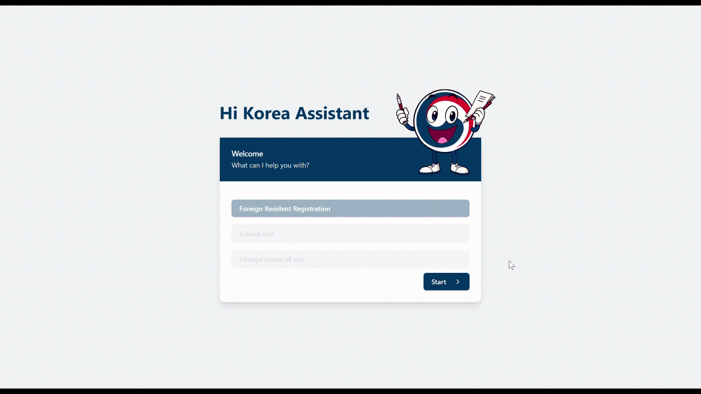

<h1 align="center" >
  <a href="https://hikorea.juanjorequena.com" target="_blank">
    
    <br>
    Hi Korea Assistant
    <br>
  </a>
</h1>
<h4 align="center">A minimal redesign of the  Hi Korea Immigration Portal.
<br>
<a href="https://hikorea.juanjorequena.com" target="_blank"> https://hikorea.juanjorequena.com </a> 
<p align="center">


</p>
</h4>
<p align="center">
  <a href="#introduction">Introduction</a> •
  <a href="#roadmap">Roadmap</a> •
  <a href="#tech-stack">Tech Stack</a> •
  <a href="#demo">Demo</a> •
  <a href="#how-to-run-the-project">How to run the project</a>
</p>



## Introduction

This project aims to revamp the user experience of [ Hi Korea immigration portal](https://www.hikorea.go.kr/Main.pt). This site provides services and information for foreigners living in Korea, such as visa applications, residency permits, and other immigration-related matters.

The goal is to provide an interactive flow where users are asked what they need, and then guided through relevant questions, avoiding long and static forms. As users progress, they fill in only the necessary information.

## Roadmap

### **Phase 1: Minimum Viable Product (MVP)**

- **Completed ✅**
- Developed the flow for **Registration as a Foreign Resident in Korea**.
- Designed a simple, user-friendly experience guiding users through the necessary steps.
- At the end of the flow, users receive a list of required documents to present at the immigration office.
- **Objective:** Deliver real value to users.

### **Phase 2: Expanding Functionalities**

- Implement additional flows for other immigration-related needs, building on the foundation created in Phase 1.
- Focus on integrating flows that provide tangible value to users.
- Enhance the user interface (UI) as this is my first project working with frontend technologies.
  - ✅ Made a responsive version for mobile! [https://m.hikorea.juanjorequena.com](https://m.hikorea.juanjorequena.com)


## Tech Stack

### Backend


### Frontend


## Demo

https://github.com/user-attachments/assets/0189e71a-fcc0-454a-a002-0af56f3c348b

## How to run the project

```bash
# Clone the repository
git clone https://github.com/wuaho/hikorea-paperman.git

# Install dependencies
pnpm install

# Run in development mode
pnpm run dev

# (Should be available in http://localhost:5173/)
```
