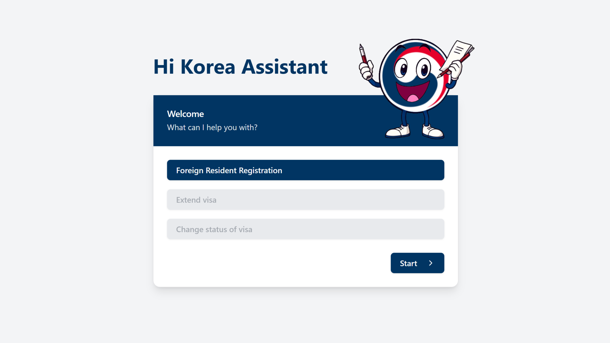

<h1>
 Hi Korea Assistant

</h1>


This project aims to revamp the user experience of [ Hi Korea immigration portal](https://www.hikorea.go.kr/Main.pt). The goal is to provide an interactive flow where users are asked what they need, and then guided through relevant questions, avoiding long and static forms. As users progress, they fill in only the necessary information.

### Demo:

### Tech Stack:

#### Backend


#### Frontend


### Features:

- **Dynamic flows**: Users select what they need, and the system adjusts the questions in real-time.
- **Intuitive interface**: A clear, guided experience with validations at every step.
- **Process optimization**: More efficient forms that reduce user input time.

### How to run the project:

```bash
# Clone the repository
git clone https://github.com/wuaho/hikorea-paperman.git

# Install dependencies
pnpm install

# Run in development mode
pnpm run dev

# (Should be available in http://localhost:5173/)
```
